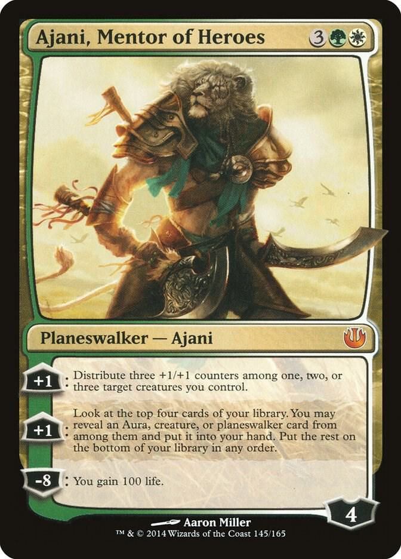

My favourite deck I've ever played with was a green-white ramp deck. The purpose of the deck was to get lots of mana with my green ramp cards, and 
use punishing big creatures, and green/white plainswalkers, to win the game. As well as my favouite deck, it was also my strongest. Here is my favourite card from the deck: 

